# Flaga trzecia
Aby zdobyć trzecią flagę należy zaatakować aplikację uruchamianą z suid bit znajdującą się w `/usr/local/bin/heheap` 
## Rekonesans 

Jak widzimy program "file" poinformował nas, iż "heheap" jest plikiem wykonywalnym 64-bitowym. 
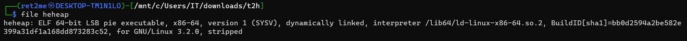  


Po uruchomieniu programu wyświetli nam się panel zarządzania kontem, w którym mamy możliwość: rejestracji, logowania i usuwania konta oraz logowania do panelu administratora.
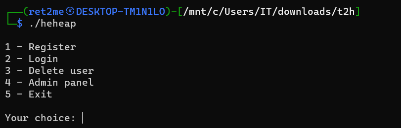

No dobrze spróbujmy zatem utworzyć użytkownika, a następnie zalogować się za jego pomocą do panelu administratora:  

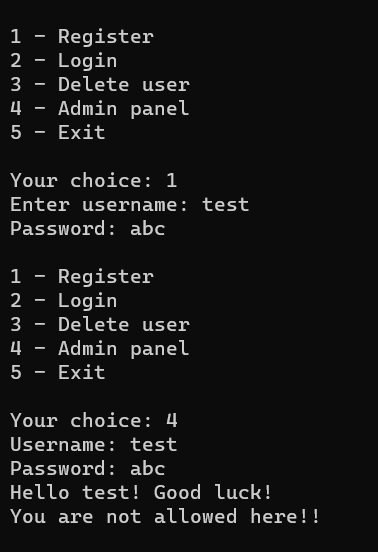

Użytkownik został znaleziony, hasło potwierdzone, lecz podany użytkownik nie ma uprawnień administratora przez co logowanie zostało odrzucone.


## Inżynieria wsteczna

Analizę programu należy rozpocząć od inżynierii wstecznej.

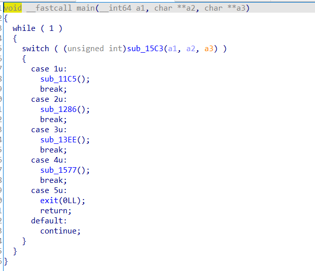

Jak widzimy nasza funkcja main zawiera switch casea osadzonego w pentli while i pięć funkcji odpowiadających za: 
* rejestrację użytkowników,
* logowanie użytkowników,
* usuwanie użytkowników,
* logowanie do panelu administratora, 
* wyjście z programu

Zacznijmy od analizy pierwszej funkcji (odpowiedzialnej za rejestrację).  

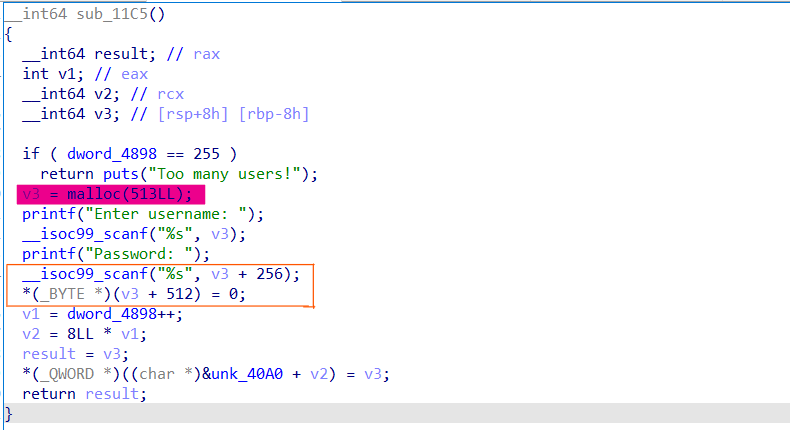

Z funkcji rejestracji możemy wydedukować, iż struktura użytkownika składa się z trzech pól:
1. nazwa użytkownika (zapisywana na początku zaalokowanej pamięci na heapie)
2. hasło użytkownika  zapisywane od 256bajtu w zaalokowanej przestrzeni   
3. bool zawierający informacje o tym, czy użytkownik jest administratorem (zawsze ustawiana na false) zapisana na 512bajcie

Najistotniejszym fragmentem tej funkcji jest pierwsza linijka w pomarańczowej ramce.   
Funkcja scanf przyjmuje hasło od użytkownika a następnie alokuje je na heapie bez weryfikacji długości danych wejściowych.
Możemy wykorzystać podatność tę, aby nadpisać dane drugiego użytkownika (wraz z polem określającym jego uprawnienia) podając ciąg dłuższy niż wielkość bloku opisującego jego dane (513bajtów). Nadpisanie drugiego użytkownika jest możliwe po usunięciu pierwszego i ponownym stworzeniu go z odpowiednio spreparowaną długością hasła. Wynika to z faktu, iż malloc zaalokuje dane o nowym użytkowniku w miejsce starego ze względów optymalizacyjnych a dane wykraczające poza zakres struktury nadpiszą dane utworzonego już użytkownika. 

A więc algorytm ataku wygląda następująco:
1. Tworzymy dwóch użytkowników o dowolnych nazwach i hasłach
2. Usuwamy pierwszego użytkownika 
3. Tworzymy nowego użytkownika podając dane które nadpiszą dane o drugim użytkowniku. 


## GDB

Uruchommy program w gdb i zobaczmy jak będzie to wyglądać to w praktyce.
Wpierw zobaczmy jak wygląda heap z dwoma "standardowymi" użytkownikami.  

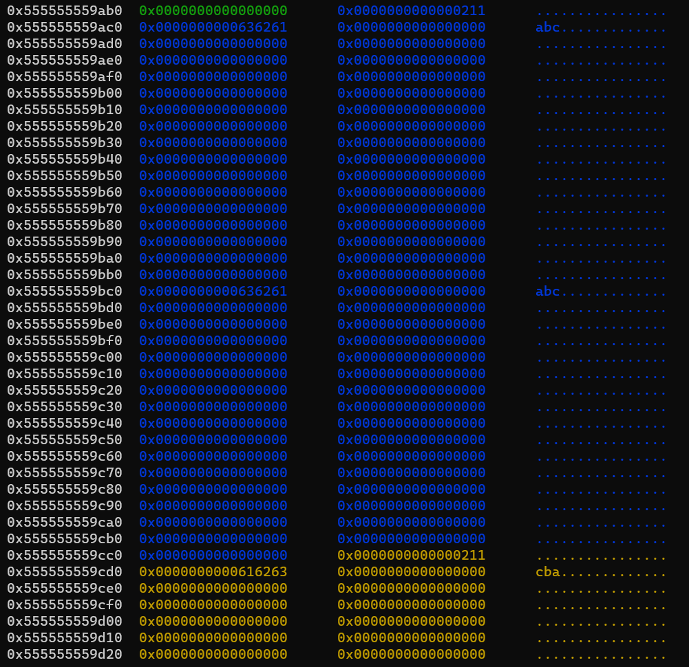
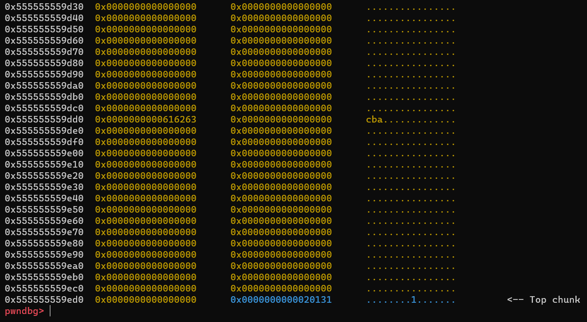

A teraz sprawdźmy co się stanie jak usuniemy pierwszego użytkownika i stworzymy nowego z podanym ciągiem jako hasło:
```
aaaaaaaaaaaaaaaaaaaaaaaaaaaaaaaaaaaaaaaaaaaaaaaaaaaaaaaaaaaaaaaaaaaaaaaaaaaaaaaaaaaaaaaaaaaaaaaaaaaaaaaaaaaaaaaaaaaaaaaaaaaaaaaaaaaaaaaaaaaaaaaaaaaaaaaaaaaaaaaaaaaaaaaaaaaaaaaaaaaaaaaaaaaaaaaaaaaaaaaaaaaaaaaaaaaaaaaaaaaaaaaaaaaaaaaaaaaaaaaaaaaaaaaaaaaaaaaabbbbbbbbbbbbbbbbbbbbbbbbbbbbbbbbbbbbbbbbbbbbbbbbbbbbbbbbbbbbbbbbbbbbbbbbbbbbbbbbbbbbbbbbbbbbbbbbbbbbbbbbbbbbbbbbbbbbbbbbbbbbbbbbbbbbbbbbbbbbbbbbbbbbbbbbbbbbbbbbbbbbbbbbbbbbbbbbbbbbbbbbbbbbbbbbbbbbbbbbbbbbbbbbbbbbbbbbbbbbbbbbbbbbbbbbbbbbbbbbbbbbbbbbbbbbbbbbbbbbbbbbbbbbbbb[NULL]ccccccccccccccccccccccccccccccccccccccccccccccccccccccccccccccccccccccccccccccccccccccccccccccccccccccccccccccccccccccccccccccccccccccccccccccccccccccccccccccccccccccccccccccccccccccccccccccccccccccccccccccccccccccccccccccccccccccccccccccccccccccccccccccccc[NULL]A
```
litery a - nadpiszą dane naszego użytkownika  
litery b - nadpiszą username sąsiedniego użytkownika  
litery c - jego hasło  
litera A - zmienia uprawnienia administratora na true (true to każda wartość inna niż zero w tym przypadku dla 'A' będzie to 65)  

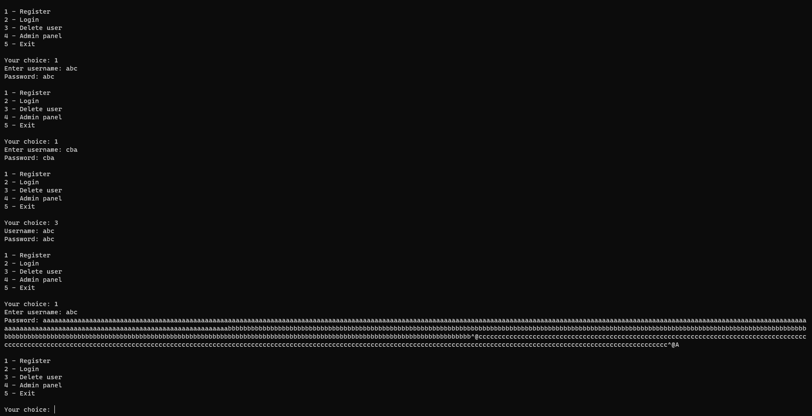


Heap po utworzeniu nowego użytkownika:  
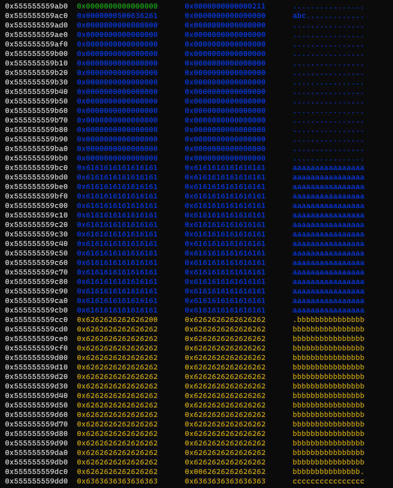
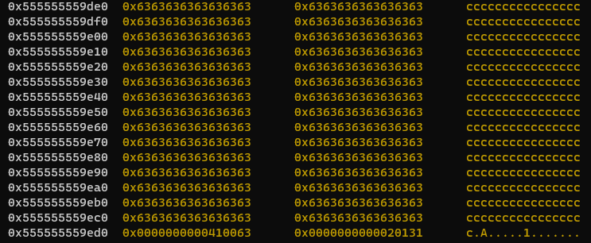  
Jak widzimy udało nam się nadpisać dane drugiego usera (wraz z bajtem odpowiedzialnym za informacje o tym, czy jest on administratorem) naszym specjalnie spreparowanym ciągiem. Teraz wystarczy już tylko się zalogować do panelu administratora naszym nowym hasłem:

```
new login:
bbbbbbbbbbbbbbbbbbbbbbbbbbbbbbbbbbbbbbbbbbbbbbbbbbbbbbbbbbbbbbbbbbbbbbbbbbbbbbbbbbbbbbbbbbbbbbbbbbbbbbbbbbbbbbbbbbbbbbbbbbbbbbbbbbbbbbbbbbbbbbbbbbbbbbbbbbbbbbbbbbbbbbbbbbbbbbbbbbbbbbbbbbbbbbbbbbbbbbbbbbbbbbbbbbbbbbbbbbbbbbbbbbbbbbbbbbbbbbbbbbbbbbbbbbbbbbb

new passwd:
ccccccccccccccccccccccccccccccccccccccccccccccccccccccccccccccccccccccccccccccccccccccccccccccccccccccccccccccccccccccccccccccccccccccccccccccccccccccccccccccccccccccccccccccccccccccccccccccccccccccccccccccccccccccccccccccccccccccccccccccccccccccccccccccccc
```

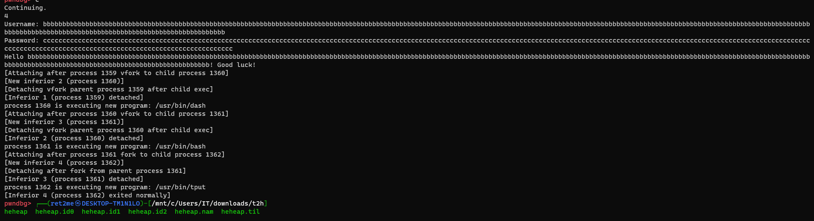


Jak widzimy po zalogowaniu się na konto administratora został uruchomiony bash z uprawnieniami administratora.

<a href="https://asciinema.org/a/Z3R3X6ICXIUB7Zpbc9t6mEVhW" target="_blank"></a>

Kiedy mamy już ułożony payload wystarczy go tylko użyć na serwerze konkursowym i odczytać flagę.
