# SeaEssAreEph
### SeaEssAreEph is a funny WEB challenge where our goal is hack money to buy a flag.  Made by Filip "Ret2Me" Poplewski member of WaletSec group
 

## Beginning
### Everything what we have got is website url and port.  
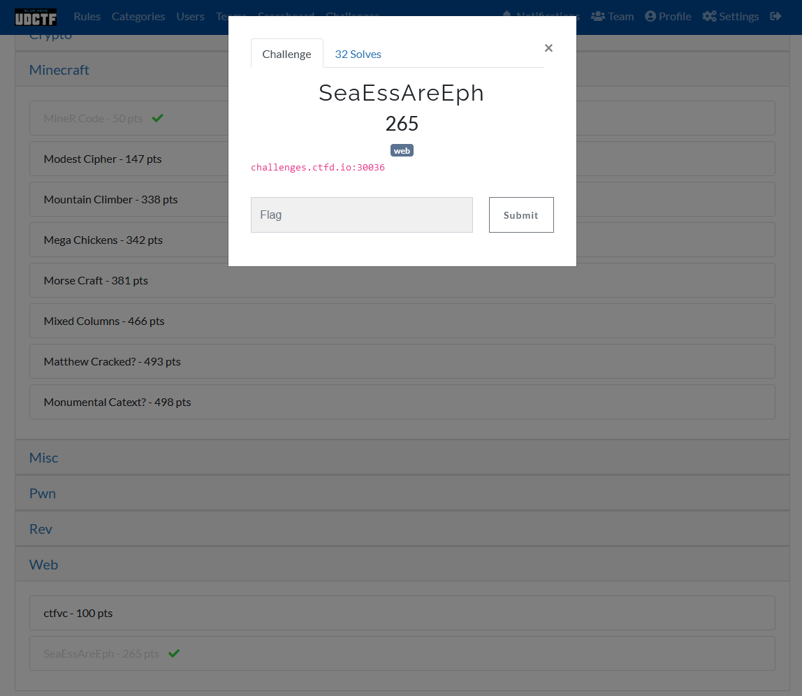
 
 

## Webpage 
### Ok so it is bank webpage, lets try find out where  might be a flag.
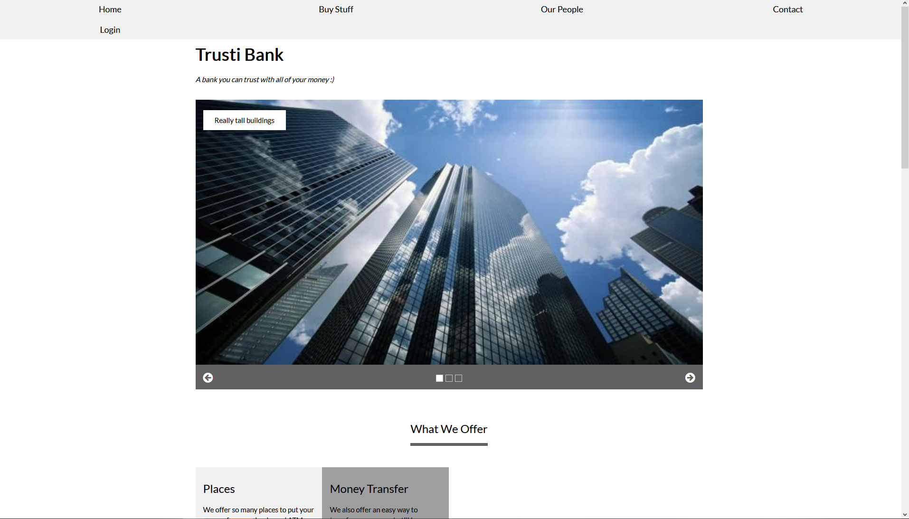
 

### Ok i see our goal is hack money to buy a flag for 1337$. 
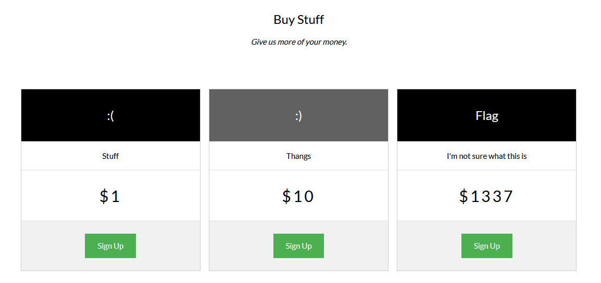
 

### At the website we can find information about CEO, random employee and <b>web admin</b>. In the future it can be used to generate <a href="https://github.com/Mebus/cupp">CUPP</a>.
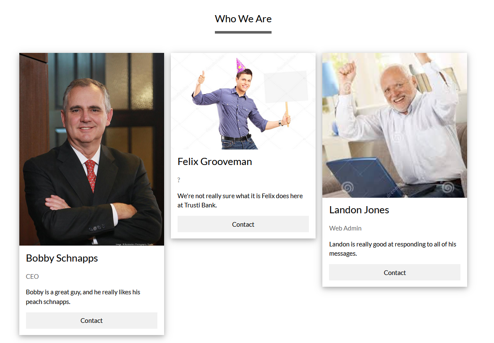
 

### When we click at Contact button, input named "To" will be filled with Bobby Schnapps username unfortunately when we click Contact to Web Admin input will be empty. 
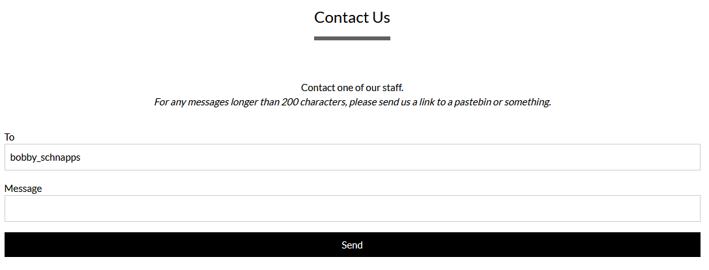
 

## Directory scanning
### At the beginning I tried scan website in search of hidden administrator panel or other interesting files).
 

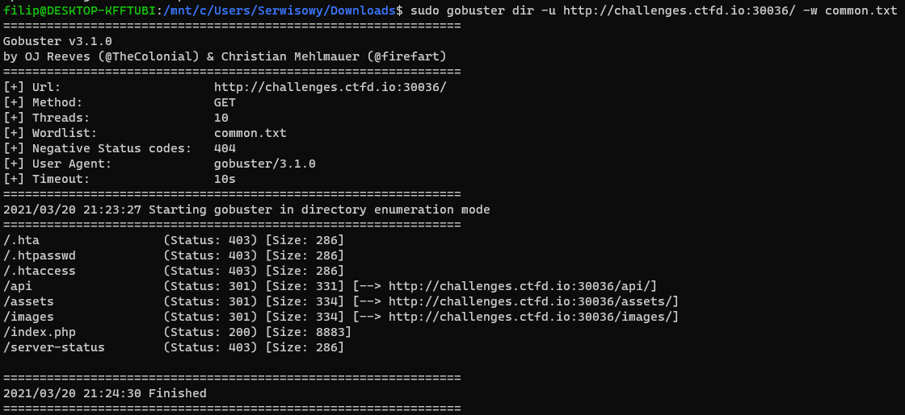
 

### As we can see scan doesn't return anything special at all (maybe API can be useful in the future, but it is a directory so right now we can't do with it anything special)
### Let's look at what we have got at robots.txt (in this file are stored directories and pages which admin want to hide against the bots)
 

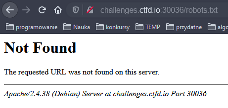
### Unfortunately nothing interesting here :(
 

## Login panel
### If user exist and password is incorrect we get error "Bad password". We know that's CEO login was name_surname let's check if web admin login was created in the same way.  
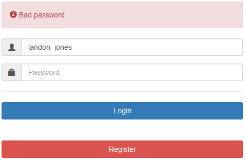
 

### Yes, we are lucky now we know what is the administrator username, nextly i tried some SQLinjection, brute force, CUPP on CEO and web administrator accounts but nothing works for me.   
 

## Source code
### Ok so let's create account (it is needed to transfer money what can be very useful) and look at the page source code.

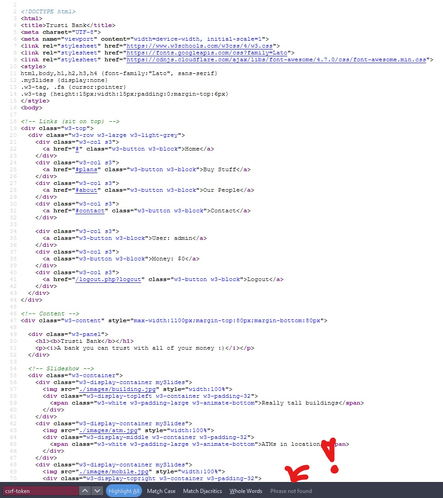
 

### As we can see webpage doesn't use any csrf-token what is critical vulnerability! We can use it to generate money transaction link which uses GET to send the param. Now we need to send malicious link to web administrator via contact form. 
 

## Attack
### In the first field we need to fill our username because when admin click at the link we want send money to our selfs. At the second field amount of money that will be send to us.
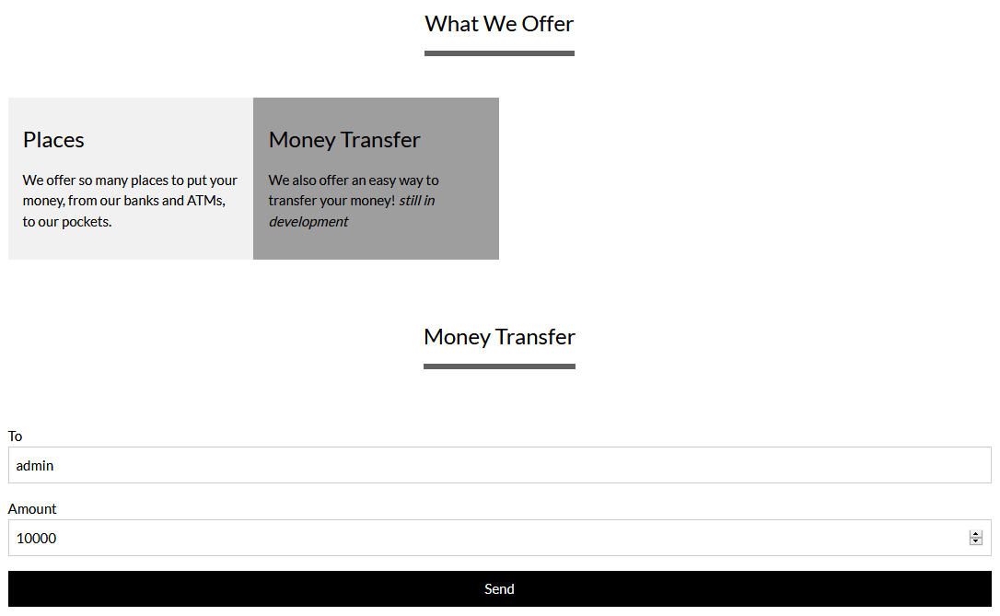
 

### "admin" is account created by me. 
 

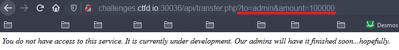
 

### now paste link to message field in "Contact us" form and click send. 
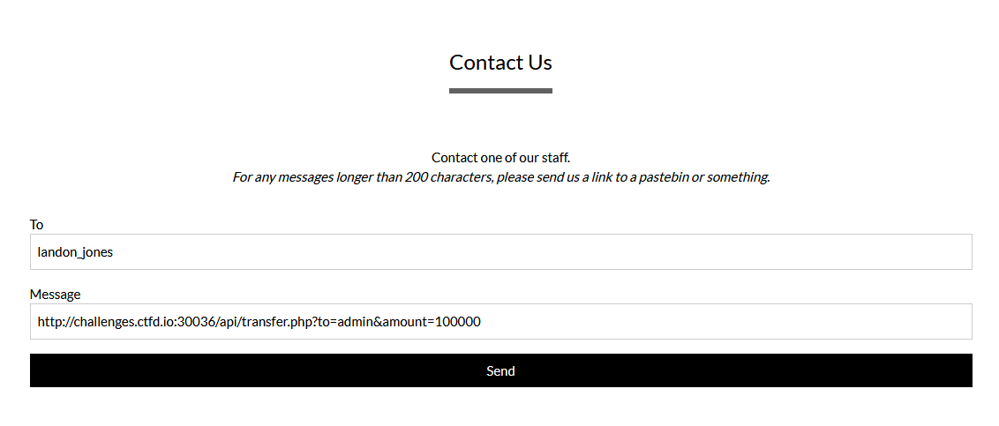
 

### The payload has been shipped lets check account balance.
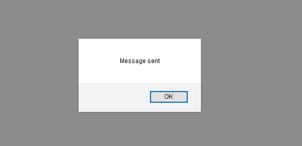
 

### we are rich, now we can buy a flag :)

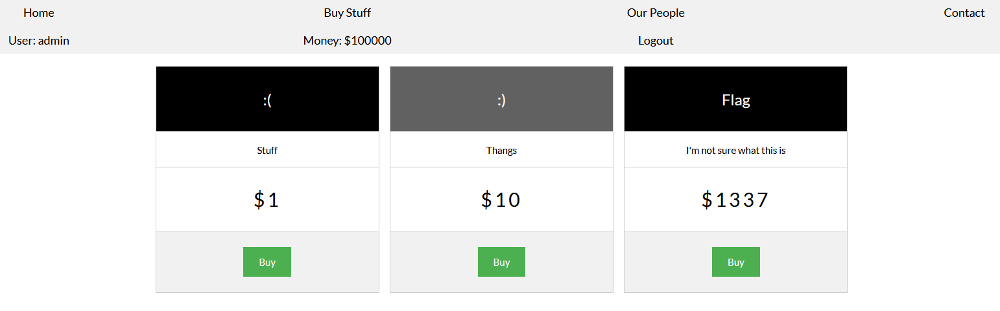
 

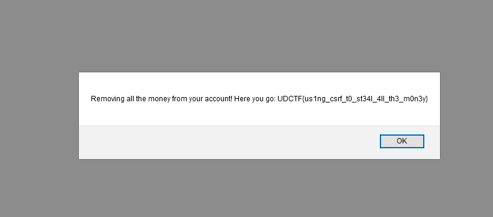
 

## End
### That was really fun and easy challange were we can learned in practice about how XSRF attack works and why it is so important to use XSRF tokens.